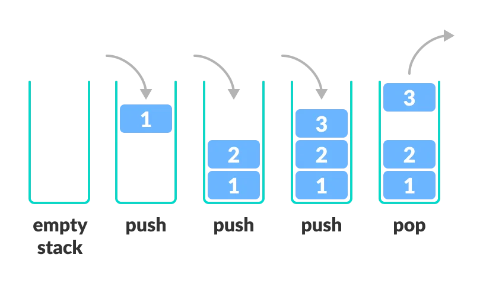

- là 1 data struture tuyến tính (linear). 
- Hoạt động theo nguyên tắc Last In First Out (LIFO).
- Giống như 1 chồng sách, Để lấy cuốn sách cuối cùng phải lấy cuốn sách ở trên trước.

- Thêm item vào top của stack được gọi là `push`, remove đi được gọi là `pop`.

- Các phương thức : 
    + `push` : thêm element vào top của stack.
    + `pop` : remove element khỏi top của stack.
    + `isEmpty` : kiểm tra stack có empty.
    + `isFull` : kiểm tra stack có full.
    + `peek` : lấy value ở top mà ko remove.

- Cách làm việc của stack : 
    + 1 pointer được gọi là `TOP` sẽ tham chiếu đến top element của stack.
    + Khi khởi tạo 1 stack thì set value của `TOP` về -1, từ đó có thể check nếu stack là empty `TOP == -1`.
    + Khi push thêm element, ta tăng `TOP` lên và lúc này `TOP` sẽ tham chiếu đến value mới.
    + Khi pop element, ta sẽ giảm `TOP` xuống và return element về.
    + Khi push thì check có full không.
    + khi pop thì check có rống không.